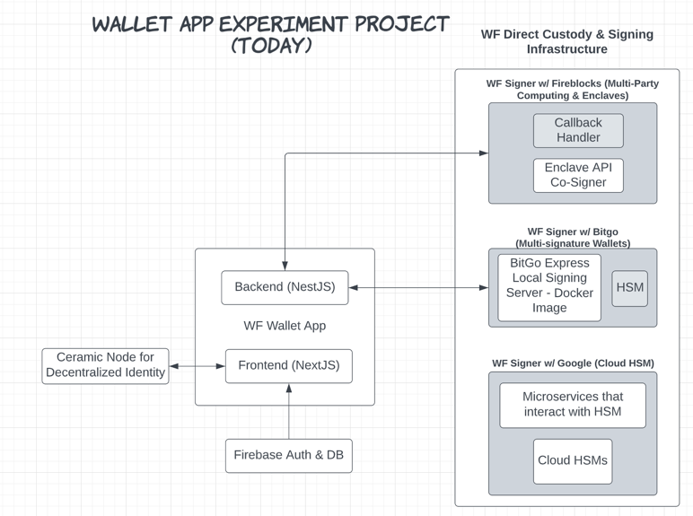

### Getting Started

### Architecture (WIP)


https://lucid.app/lucidchart/17d6ec18-0a55-4525-879f-b62e62618ec7/edit?viewport_loc=-76%2C-120%2C2273%2C1233%2C0_0&invitationId=inv_c4e17f19-afbd-43c3-8227-595913ee0788#

### Stack
Backend - NestJS

Frontend - NextJS

#### Crypto Libraries
Bitgo

Fireblocks

#### Bitgo Signer
Currently for this POC we are using a docker instance of the signer

#### Fireblocks Signer
Azure Cloud to host both the API Callback Handler and API Co-Signe

API Co-Signer uses Intel SGX enclave device to secure the key shards stored in a secret DB

### Setting Up the Project
#### Backend
Copy the env.example file in the packages/backend folder and populate the variables.

You'll need an API token from BitGo and Fireblocks, check their website on how to procure one.

Fireblocks will also require a cert

#### Frontend
Copy the env.example file in the packages/frontend folder and populate the variables.

You'll need an API token from Firebase Google and a project ID

### Running this Project
#### Starting BitGo Express Server - Running Docker Image
Starting BitGo Express Server, go to the root directory of the project and start Bitgo-Express Docker image:
```bash
docker-compose up
```

#### Installing the Dependencies
In the root directory run the following command:
```bash
npm run install
```

#### Running the Backend and Frontend Projects
In the root directory run the following command:
```bash
npm run start
```
### URL for Backend
After everything is up and running go to the backend swagger docs
[http://localhost:9000/api-docs
](http://localhost:9000/api-docs)

You can also test the API's using the postman collection found in the /packages/backend/postman folder. 
### URL for Frontend
After everything is up and running go to
[http://localhost:3000
](http://localhost:3000)


## Modifications

### Backend

##### Image Rebuild
After making changes re-build the image using the command below:

`docker-compose up -d --build backend`

Test your image locally using the command below:
`docker-compose up -d --build backend`

##### Deploying Image to Serverless Environment

We are deploying our docker images to Google Cloud's Container Registry.

To re-deploy the image to the registry, run the following command:
1. Tag the image with the tag you want to use.
```aidl
docker tag backend us-central1-docker.pkg.dev/wallet-app-54dff/defi-wallet-app/backend:tag1
 ```
2. Push the image to the registry.

```aidl
docker push us-central1-docker.pkg.dev/wallet-app-54dff/defi-wallet-app/backend:tag1
```

3. Verify that the image is now available in the registry. By visiting the following page in the console:
   https://console.cloud.google.com/artifacts/docker/wallet-app-54dff/us-central1/defi-wallet-app?project=wallet-app-54dff


###NOTES

Start presentation with use case, the goal is to buy, sell, and hold
- Mention that this is just about the hold part

Mention that Ops Manager uses the vendor's console
- Connect it to George's story

Check if the whitelisting is on a wallet level

Look into BitGo's MPC implementation

Mention APIs for policy with BitGo and Fireblocks
- Bitgo has APIs for policy but Fireblocks doesn't
   - Mention the beta policy mgmt for Fireblocks but don't show the clips
   - Include it in the Ops Manager
  
Show Transaction ID with link after transaction is sent
https://blockstream.info/testnet/tx/ba5a4b0c06ea443535853e8aeb0d7fb2be08570ac941916cedcb0faebd86c5a1

Have the same currency for both only Bitcoin Testnet

Throw an alert that says can't delete wallet

TODO: Look at BitGo policy APIs

Disable Share button
 
Fix load time for the wallet addresses
Create a power point
- include video links on the PPT (remove the passwords)
- Remove technology page and put it in the slide

Show how to send funds from Fireblocks to BitGo

add refresh after all activities

After fireblocks transaction show the transaction ID and URL
https://ropsten.etherscan.io/tx/0xacd76f87aae3ce5d20f6bf0a847503d900d8f87a10bac5c5a7da5c393c19ef64
Show the tracnsaction ID on BlockDaemon


Include the type of crypto for each wallet in bitgo wallet

Remove frozen column in fireblocks view wallet modal

remove the delete button from Bitgo Wallet view

mention that we are not buying, selling, just transfering

After the wallet demo, open up the presentation with technology information
- Notes & comparison
- Include the diagram sent us with confluence site links

Can do Opals the Ops manager jobs with APIs, or is there a single sign-on
- What are the options for seamless integrations
- Add parenthesis on if the function is available on API

Relate back to the customer when going through structure

When talking about Opal the Ops Manager mention that the API keys would possibly be handled from a tech side

Before I begin mention that this is sitting on my PC

Mention the Asset To the Wallet
- How does the customer relate to the wallet

In Fireblocks Send remove fee field
- Also remove asset field keep the two api's separate