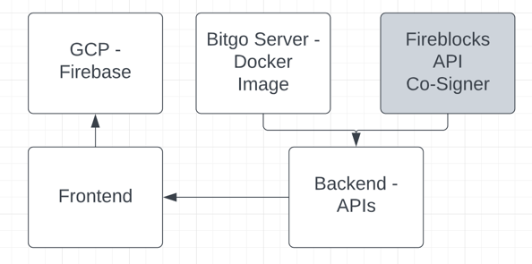

### Getting Started

### Architecture (WIP)


https://lucid.app/lucidchart/87e5866a-3231-491e-8be2-fcadd8c0b00a/edit?viewport_loc=-10%2C-74%2C1516%2C823%2C0_0&invitationId=inv_56dbf55e-9189-4098-bf52-b859954aa493#


### Stack
Backend - NestJS

Frontend - NextJS

#### Crypto Libraries
Bitgo

Fireblocks

#### Bitgo Signer
Currently for this POC we are using a docker instance of the signer

#### Fireblocks Signer
Azure Cloud to host both the API Callback Handler and API Co-Signe

API Co-Signer uses Intel SGX enclave device to secure the key shards stored in a secret DB

### Setting Up the Project
#### Backend
Copy the env.example file in the packages/backend folder and populate the variables.

You'll need an API token from BitGo and Fireblocks, check their website on how to procure one.

Fireblocks will also require a cert

#### Frontend
Copy the env.example file in the packages/frontend folder and populate the variables.

You'll need an API token from Firebase Google and a project ID

### Running this Project
#### Starting BitGo Express Server - Running Docker Image
Starting BitGo Express Server, go to the root directory of the project and start Bitgo-Express Docker image:
```bash
docker-compose up
```

#### Installing the Dependencies
In the root directory run the following command:
```bash
npm run install
```

#### Running the Backend and Frontend Projects
In the root directory run the following command:
```bash
npm run start
```
### URL for Backend
After everything is up and running go to the backend swagger docs
[http://localhost:9000/api-docs
](http://localhost:9000/api-docs)

You can also test the API's using the postman collection found in the /packages/backend/postman folder. 
### URL for Frontend
After everything is up and running go to
[http://localhost:3000
](http://localhost:3000)


## Modifications

### Backend

##### Image Rebuild
After making changes re-build the image using the command below:

`docker-compose up -d --build backend`

Test your image locally using the command below:
`docker-compose up -d --build backend`

##### Deploying Image to Serverless Environment

We are deploying our docker images to Google Cloud's Container Registry.

To re-deploy the image to the registry, run the following command:
1. Tag the image with the tag you want to use.
```aidl
docker tag backend us-central1-docker.pkg.dev/wallet-app-54dff/defi-wallet-app/backend:tag1
 ```
2. Push the image to the registry.

```aidl
docker push us-central1-docker.pkg.dev/wallet-app-54dff/defi-wallet-app/backend:tag1
```

3. Verify that the image is now available in the registry. By visiting the following page in the console:
   https://console.cloud.google.com/artifacts/docker/wallet-app-54dff/us-central1/defi-wallet-app?project=wallet-app-54dff

